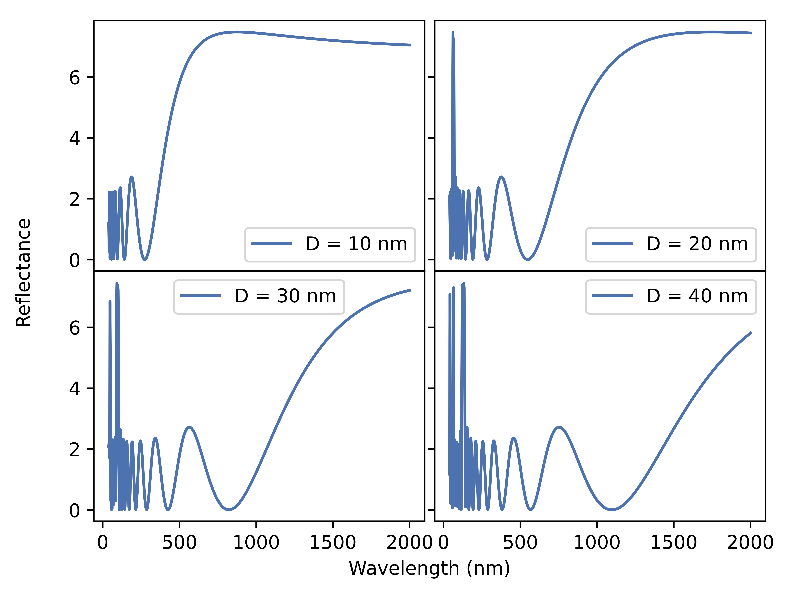

# Transfer Matrix Algorithm for Stratified Media

## Introduction

We aim to simulate light propagation through stratified media. We apply the algorithm to the study of reflectance coefficient of light passing through layered polymer chunks mediated by graphene oxide layers.

## Method

### Setting up the system

We satisfy the boundary conditions at each layer using a transfer matrix method. We build the transfer matrix for the system by composing layers of graphene with `multiply_by_layer` and chunks of polymer plus graphene layer with `multiply_by_chuck`.

These take the refractive index of each media (`n_in`, `n_pol` and `n_out`) as well as the length of the polymer 
`d`.

Once the transfer matrix is built the method `get_coeffs` may be used to calculate the reflectance, transmittance and absorption of the system.

The matrix should be initialized with a list of wavelengths at which the computations will be realized. These may be used to plot the coefficients against wavelength plots, as well as for coefficients vs number of layers plots at each wavelength. The index corresponding to each wavelength `wl_ind` needs to be passed as an argument while building the transfer matrix as the conductivity at each layer may have wavelength dependence.

### Plotting

Once an instance of the transfer matrix is created, one may use the many default plotting methods to plot the coefficients versus number of chunks or wavelength, for fixed polymer lengths (or wavelengths).

Plotting methods for reconstructing the fields along the system also exist, as well as heatmaps of the coefficients as function of wavelengths and polymer length.

While the use of each plotting method should be clear enough, some general tips follow:

- Some methods take a float value of polymer length others a list of lengths for each polymer layer.
- The methods for 2 layers systems and multilayer systems as the polymer-graphene-polymer intermediate transitions don not happen on the 2 layer system. These take a float value of polymer length, as well as a float value of the polymer refractive index, as there is only one such chunk.

## Examples

Plotting of reflectance versus wavelength for polymer length of 20 nm and constant conductivity.

